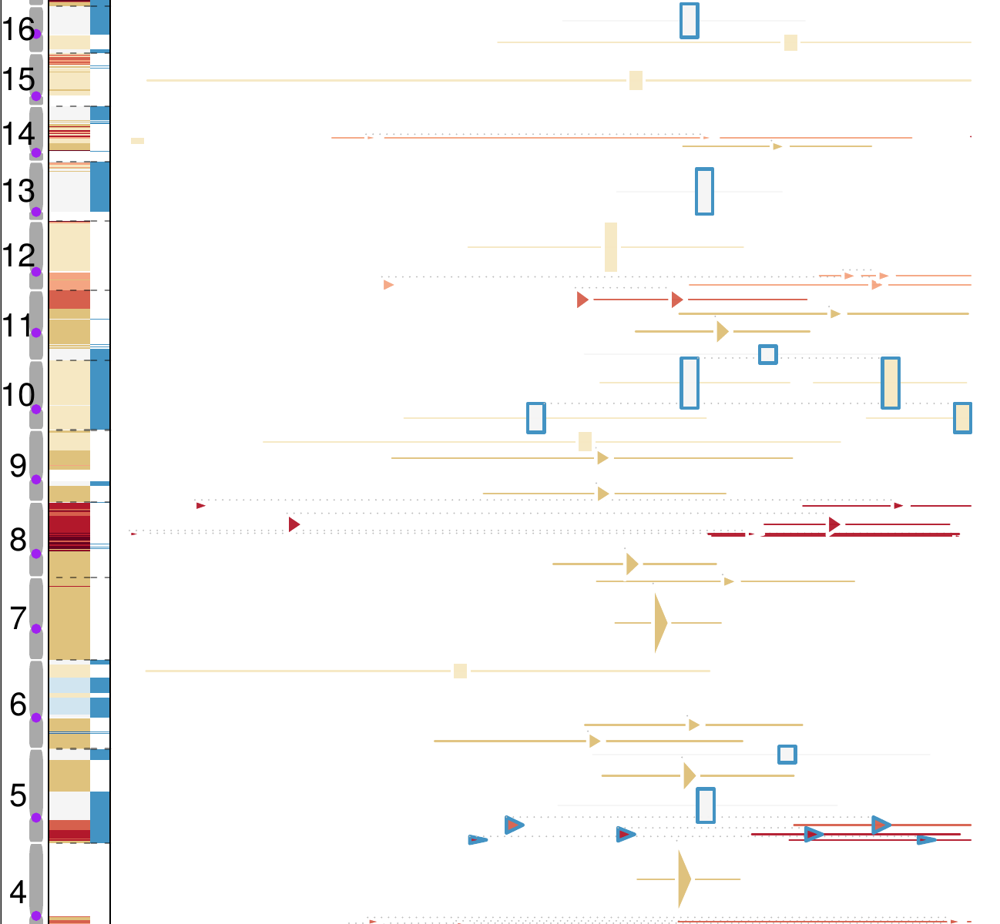

As a group specialized in computational genomics at the University of Minnesota, we develop tools in quantifying and modeling tumor heterogeneity (TH) from high-throughput sequencing data. We in turn leverage the patterns of TH to study the dynamics of cancer and to identify genomic alterations that affect the rate of tumor progression.

---
**_Timing of SCNAs_**: A genomic region, when resting on a copy number (CN) state, acquires mutations at a rate proportional to its CN. Leveraging this bias, we can chart the relative timing of somatic copy number aberrations (SCNAs) during the initiation and progression of individual tumors. In this [preprint](https://doi.org/10.1101/2022.06.14.495959), we uncovered late CN gains appearing right before the onset of clonal expansion and modeled their fitness effect in promoting tumor growth.

---

---
**_Tumor Clonal Dynamics_**: we perform `data driven modeling` of single-cell based spatial tumor growth, to reveal the principles that govern the relation between genomic heterogeneity, clonal dynamics, and sequencing detectability of somatic variants. We have utilized this strategy to express the genomic divergence between metastatic and primary tumors in terms of the time and mode of metastatic seeding. [paper](https://doi.org/10.1371/journal.pcbi.1008838)

---

[//]: # 

[//]: # {: style="float:left; padding:1px"}

---
**_Computational Genomics in Tumor Heterogeneity_**: We push the limits in computational methods to achieve a high-fidelity quantification of (epi)genomic heterogeneity from tumor sequencing data (including CNA, SV, SNV, Gene Expression etc). Biases are inescapable but can be informative when we understand them better. [paper](https://doi.org/10.1038/ng.3891)
<!-- Example: [VAP](https://combine-lab.github.io/VAP/) -->

---

---
**_Visualizing Genomic Heterogeneity_**: Data visualizaion plays critical role in computational genomics. We develop visualization tools for tumor sequencing data to reveal the patterns of tumor heterogeneity, facilitate feature extraction, identify potential biases and inspire hypotheses regarding the dynamics of human cancers. [Software to be released]
<!-- Example: [VAP](https://combine-lab.github.io/VAP/) -->

---
